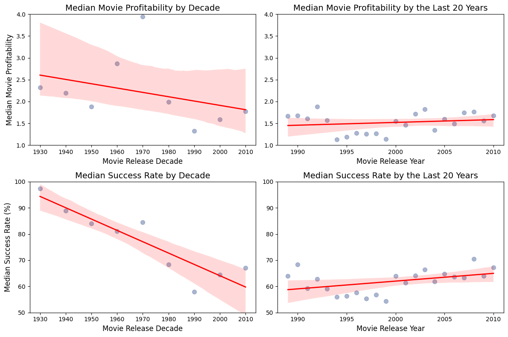
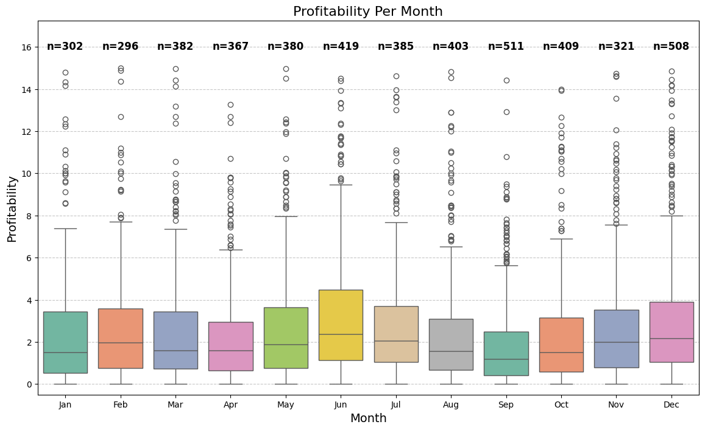
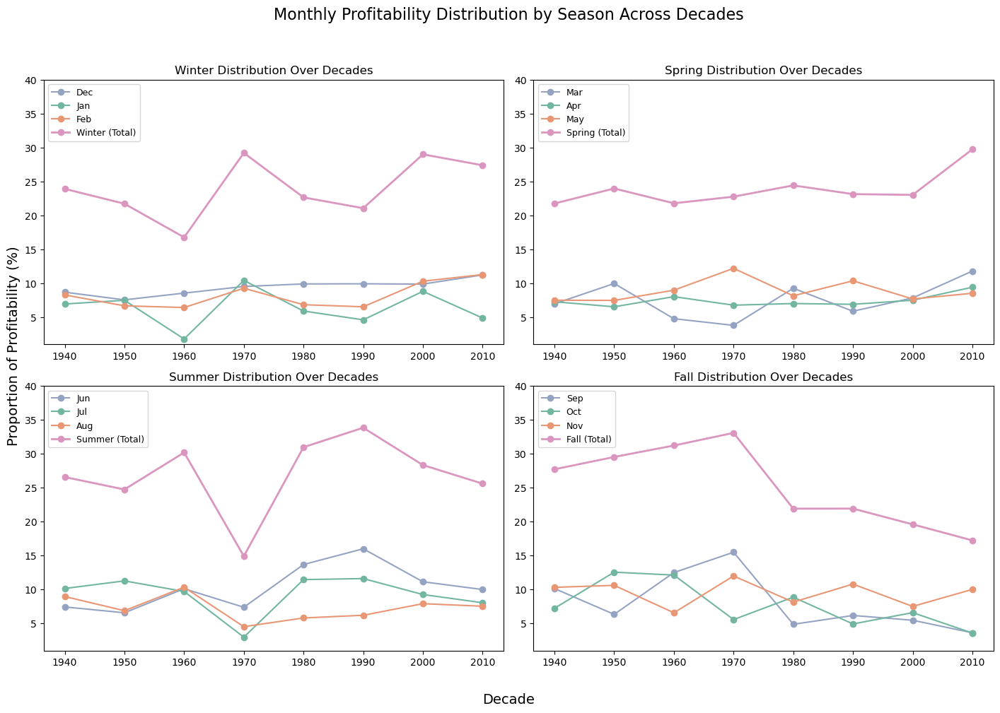
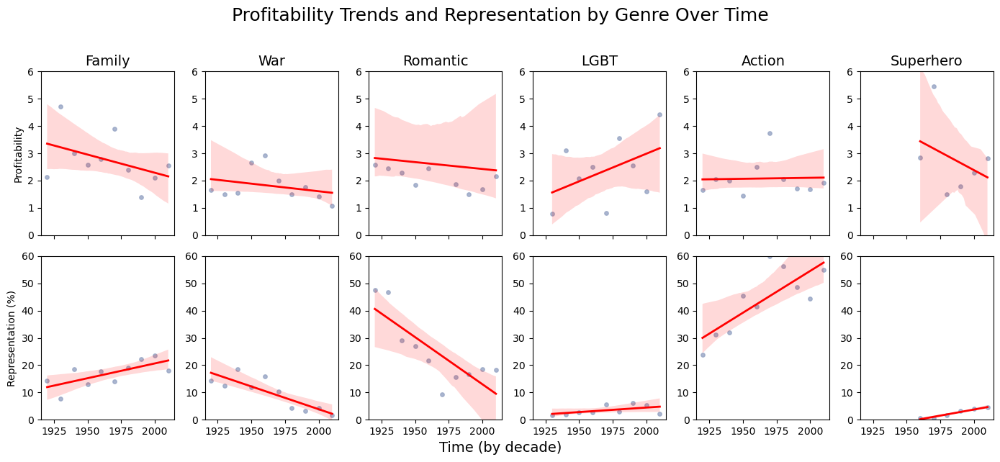
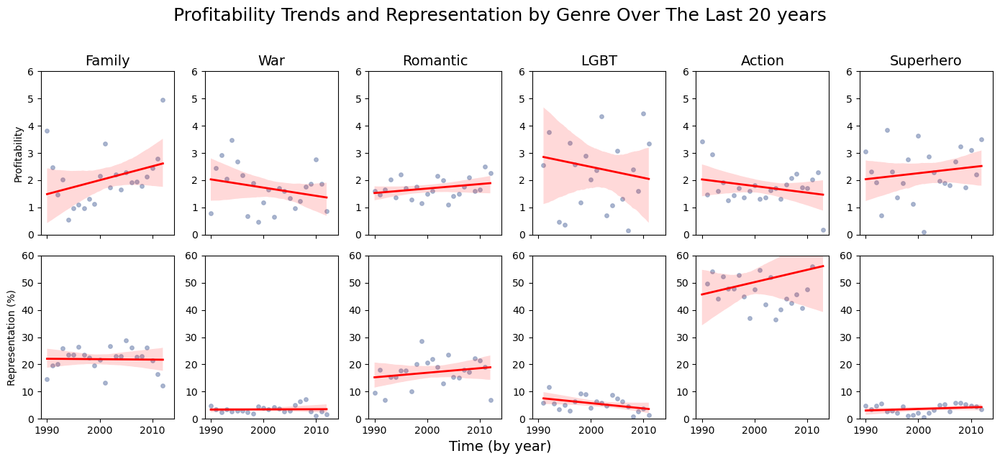
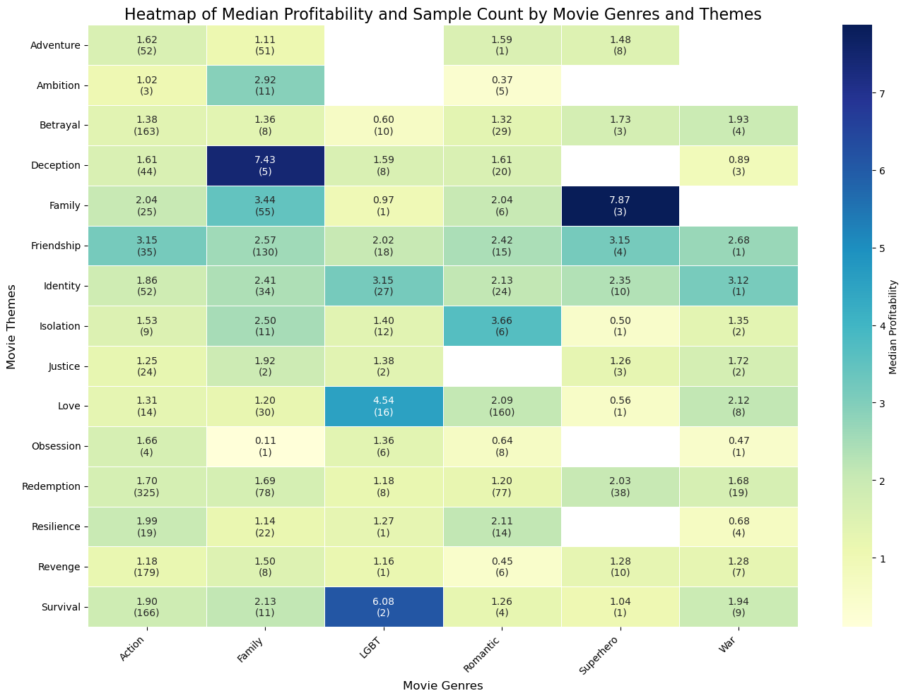

Annabel, a young data analyst, has just joined a major American film studio preparing to release a range of new movies in 2025. After several disappointing box-office results in recent years, the CEO wants to maximize the chances of success by identifying ideal release periods along with what kind of movies are the most popular, and therefore profitable. By analyzing historical trends and patterns, Annabel’s job is to advise on the best release timing for each upcoming movie while also pinpointing the key factors that make movies popular. Her findings ultimately reveal a deeper truth about how movies evolved over time.

**What Drives Movie Success: Genres, Themes, or Release Timing?**
To guide her analysis effectively, Annabel considers which factors contribute most to a movie’s success. Taking the perspective of a producer focused solely on maximizing revenue, she chooses to evaluate success based on profitability, measured as the ratio of box office revenue to production budget. This approach reflects financial success regardless of audience appreciation, which isn’t always a reliable indicator in today’s market (as seen with recent Star Wars episodes).

Note: We assume that the dataset is representative of the movie industry in terms of genre distribution, meaning no specific genre is disproportionately underrepresented in any given year. However, the overall number of movies in the dataset may not be evenly distributed across time, as older movies (e.g., from 100 years ago) are less likely to be included compared to more recent releases. This does not imply that fewer movies were produced in the past.

After merging data from multiple sources, cleaning and handling it, Annabel is left with movie records spanning over 100 years. She wonders whether including such old data is meaningful and won't harm her analysis, given how much society has evolved over time. Factors like movie runtimes, peak release months, popular genres, and dominant themes may have changed significantly. For example, early films often had shorter runtimes due to technological limitations, while genres like superhero movies only gained popularity in recent decades.

However, first, she asks herself if there is anything to analyze to draw conclusions on.

<figure class="plot1">
    
    <figcaption>Figure 1: A visualization of my data number 1.</figcaption>
</figure>

<figure class="plot2">
    
    <figcaption>Figure 1: A visualization of my data number 2.</figcaption>
</figure>

Annabel began her analysis by examining the fundamentals: how does profitability vary month by month, without yet accounting for historical shifts or seasonal groupings over time? To address this, she introduced Figure 1: Profitability Per Month in her report. This figure presents boxplots of profitability for each month, enabling readers to see the central tendencies, variability, and the presence of unusual values (outliers) in a straightforward, comparative manner.

<figure class="plot3">
    
    <figcaption>Figure 3: Profitability Per Month.</figcaption>
</figure>

Looking closely at the figure, one can discern notable patterns. Some months, such as June or December, show a higher median profitability, represented by a taller box and median line situated at a relatively elevated position on the y-axis. This suggests that, on average, films released in these months tend to achieve better returns. However, these months also exhibit a larger spread of values and more outliers, implying a greater degree of unpredictability—while many films do well, a few may significantly overperform, skewing the distribution. Other months, like January or March, have slightly lower medians and more compact interquartile ranges. This tighter grouping indicates that while results may be more modest, they are also more consistent, with fewer extreme outcomes.

Additionally, the number of data points (indicated by "n=" above each box) varies, reflecting industry behaviors. Months with a higher volume of releases may show more dispersion, as a greater variety of films—from low-budget indies to tentpole blockbusters—enter the market. This influences not just central profit tendencies but the overall shape of the distribution.

By analyzing these boxplots, Annabel can identify months that historically yield steadier results versus those offering the potential for higher peaks but also larger risks. This initial examination lays the groundwork for her subsequent figures and analyses, which delve into how these patterns evolve over decades or shift when aggregated into seasons. Understanding the month-by-month baseline is crucial before exploring longer-term trends and more complex scheduling considerations.

<!--  -->

Annabel’s analysis reached a critical juncture once she compiled historical profitability data by month and grouped it by season over multiple decades. Up to this point, she had discussed the importance of timing in movie releases, examined correlations between genre and seasonal trends, and highlighted how cultural events influenced audience turnout. Now, she needed to present concrete evidence of how these patterns had evolved over time.

This is where Figure 4: Monthly Profitability Distribution by Season Across Decades is introduced, placed after the initial descriptive analysis of overall seasonal shifts. The figure consists of four panels—one for each season—displaying how each month’s share of profitable outcomes has changed over successive decades. By examining these lines, one can observe long-term trends, such as the gradual strengthening of certain winter months or the periodic rises and falls in summer profitability.

<figure class="plot4">
    
    <figcaption>Figure 4: Monthly Profitability Distribution by Season Across Decades.</figcaption>
</figure>

Annabel would present the figure immediately following her general overview of seasonal tendencies. Prior to showing it, she briefly discusses the methodological approach: how profitability percentages were calculated per decade, how months were assigned to seasons, and why focusing on aggregated historical data can provide a more stable reference point than short-term fluctuations.

When decision-makers review Figure 4, they can identify patterns, for example, the sustained growth in spring months or a mid-century decline in certain fall months. Each seasonal panel includes both individual months and the total seasonal trend, aiding in understanding not only the contribution of each month but also the collective seasonal profile.

After the figure, Annabel draws attention to key observations. For instance, she might note that the winter season consistently maintained a relatively stable share, while summer saw significant variability, influenced by evolving industry strategies for blockbuster releases. These insights equip the studio’s planning team with a data-driven foundation to fine-tune their scheduling decisions, ensuring that release dates align more closely with historically proven profitable periods.

<figure class="plot5">
    
    <figcaption>Figure 1: A visualization of my data number 5.</figcaption>
</figure>

<figure class="plot6">
    
    <figcaption>Figure 1: A visualization of my data number 6.</figcaption>
</figure>

    

<figure class="plot8">
    
    <figcaption>Figure 1: A visualization of my data number 8.</figcaption>
</figure>