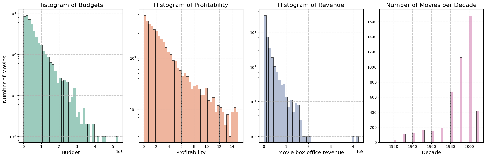
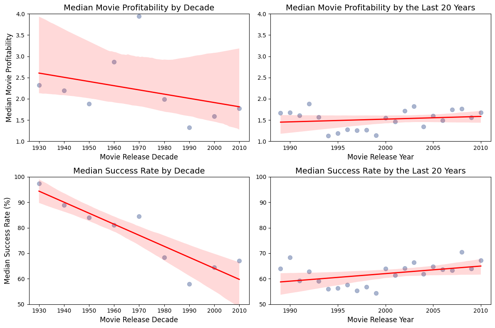
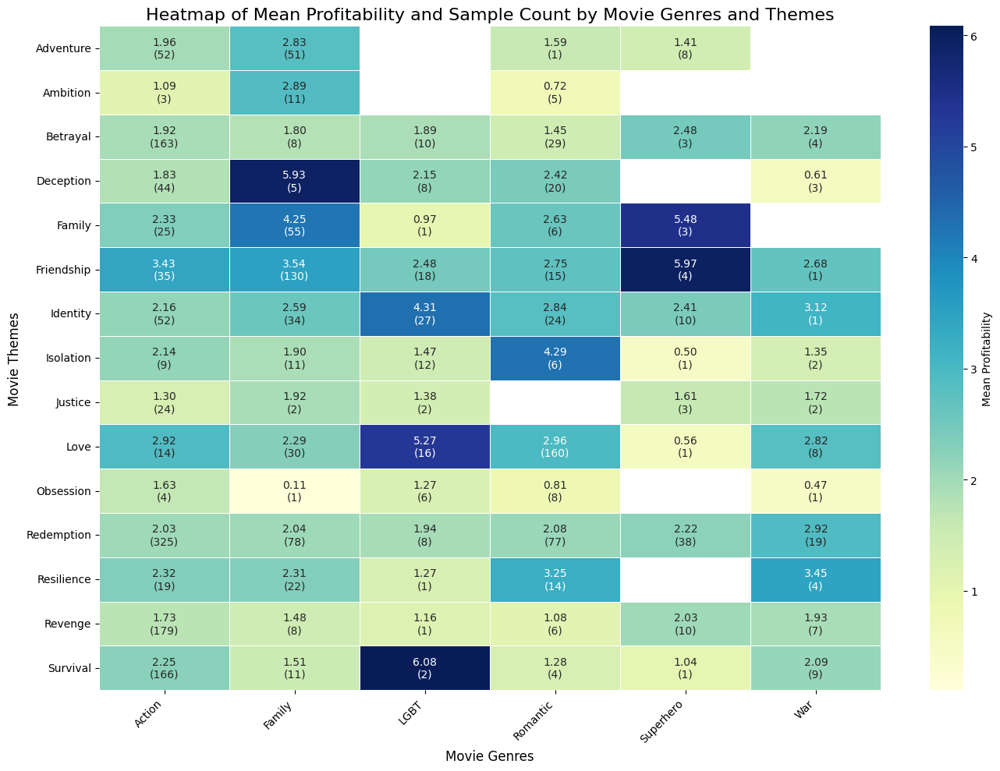

Annabel, a young data analyst, has just joined a major American film studio recently backed by a new investor financing movies across six genres: Family, War, Romance, LGBT, Action, and Superhero. After several disappointing box-office results, the CEO—promised a cut of each movie's profits—wants to identify the most profitable genres, ideal release periods and best general practices. Annabel’s job is to uncover key factors driving movie success through historical trend analysis. She has a cleaned dataset representative of the US movie industry in genre proportions, though not in the total number of films. The dataset includes over 50,000 American movies, with budget and revenue figures (adjusted for inflation) available for nearly 5,000 of them.

### What Drives Movie Success: Genres, Themes, or Release Timing? 
Focusing on profitability, measured as the ratio of box office revenue to production budget, Annabel evaluates financial success rather than audience appreciation which doesn't always define how profitable a movie is (think about the last Star Wars episodes...). She wonders if including older records might distort her analysis due to changes in movie-making trends like runtimes or evolving genre popularity. But before, she asks herself: Is there enough meaningful data to draw actionable conclusions?

<figure class="plot1">
    
    <figcaption>Figure 1: budget, profitability, revenue and sample count data distributions.</figcaption>
</figure>

Annabel’s data review reveals a wide range of budgets, from small films to big-budget blockbusters, and a broad spectrum of profitability and revenue figures. Relieved by this variety, she’s confident her analysis will be meaningful. However, the number of movies per decade is low for the earlier years, which she will have to pay attention to. 

### How Did Film Profitability and Success Rates Evolve?
Annabel suspects movies are less profitable today due to competition from alternative entertainment forms. To test her hypothesis, she considers a movie being successful if profitability > 1 and uses the median profitability due to skewed distributions and aggregates by decade to account for the low amount of samples in the earlier years, while also plotting yearly trends for recent decades with more data available.

<figure class="plot2">
    
    <figcaption>Figure 2: regression plots with 95% confidence intervals showing median profitability and success rates by decade and for the last 20 year.</figcaption>
</figure>

As she feared, when looking at the century-spanning trends, Annabel found that overall profitability and success rate declined over time. In the most recent 20-year window, the data suggested a leveling-off in this decline. After observing changes in years, Annabel is now wondering how profitability varies month by month. 

### How Do Movie Release Schedules Affect Profitability?

<figure class="plot3">
    
    <figcaption>Figure 3: profitability across months.</figcaption>
</figure>
Some months regardless of the release year, such as June or December, exhibited higher median profitability, but also greater unpredictability. Others, like January or March, showed lower returns on average, yet more consistency and fewer extreme results. Annabel is ecstatic about the results! Therefore, she decides to investigate further by seeing what months were the most profitable across decades, represented as the month's share of profitability across the total profitability of the decade, and more generally across seasons. 

<figure class="plot4">
    
    <figcaption>Figure 4: Monthly Profitability Distribution by Season Across Decades.</figcaption>
</figure>
Once again, she observes changes across decades and identifies patterns. She sees growth in spring months and from the mid-century, a decline in certain fall months, winter season consistently maintaining a relatively stable share, while summer saw significant variability. Now Annabel focuses on how profitability and genre representation have shifted over time across various film genres. 

<figure class="plot5">
    
    <figcaption>Figure 5: Median profitability and representation by genre over time.</figcaption>
</figure>
From the data, Annabel notes several patterns. Over the decades, family films became more common but less profitable, while war and romantic films declined in both frequency and returns, reflecting shifting audience preferences and historical contexts. In contrast, LGBT films saw increased representation and profitability as social attitudes evolved. Action films expanded their market share while maintaining stable financial performance. Superhero films emerged later, experiencing profitability peaks and gradually increasing in presence.

While analyzing long-term trends reveals how societal preferences have evolved, Annabel's objective is better served by focusing on the past 20 years. Examining median profitability and representation during this period could provide valuable insights for predicting future market dynamics.

### Do movie genres and themes affect profitability?

<figure class="plot6">
    
    <figcaption>Figure 6: Median profitability and representation by genre over the last 20 years</figcaption>
</figure>

The results did not disapoint, there are some differences with the per-decade figures. In the past two decades, family films have rebounded in profitability, suggesting better alignment with audience preferences. War films, though still less profitable, have stabilized in representation. Romantic films appear to have plateaued after a long decline. LGBT films, once steadily rising, now show more variability, indicating an evolving market. Action films continue their profitable upward trend, while superhero films, benefiting from established franchises and strategic marketing, demonstrate clear growth.

By comparing these recent trends with the longer historical arcs, Annabel demonstrated that while past patterns provide context, current trends can differ meaningfully. Annabel establishes that no single pattern applies universally. Some genres fade, some find steady ground, and others expand into new opportunities. She waits before drawing any conclusions and continues her analysis of the last 20 years through considering budget and runtime as variables that can influence profitability. 

    
    <figcaption>Figure 7: Median profitability per genre and release month. Users can adjust the bubble size to visualize different metrics—such as median budget, runtime, or sample size.</figcaption>

Through the interactive plot, Annabel visualizes multiple dimensions simultaneously, connecting earlier findings and emphasizing month-by-month analysis. She seeks bubbles positioned high, indicating strong profitability, with small budgets and high sample counts, ensuring the figures are robust and supported by more data. The analysis reveals that optimal release strategies vary by genre, each having different budgets, runtimes, and release months, most are peaking around December and June, consistent with earlier findings.

## What genre-theme pairs maximize profitability?
Annabel wonders how the combination of a film’s genre and underlying theme might influence its financial performance. She decides to use the mean profitability as metric instead of the median, as some sample sizes are very small.

<figure class="plot8">
    
    <figcaption>Figure 8: Heatmap of mean profitability for each theme-genre pair</figcaption>
</figure>

Annabel could identify which theme-genre pair seems to resonate strongly with audiences within particular genres. Sample size has its importance too : while a higher sample size may indicate more robust values, low sample sizes means a theme-genre pair wasn't done that much, and if the first movies for it went well indicate there might be a market opportunity.

## Study case: War movies

Before stating her official guidelines to the film studio, she wants to see how major events (like wars) influenced movie releases of the war genre. 

She researches the evolution of the number of US war movies released every year and compares it with the overall number of releases to see if major conflicts had impacted the genre.

<figure class="plot9">
    
    <figcaption>Figure 9: Movie releases per year (smoothed on a 3-years window)</figcaption>
</figure>

Although at a glance it seems that conflicts such as WWII, the Vietnam War or the Cold War did induce some peak of war movies releases, she tries to confirm it by computing the Pearson correlation between the number of war movies and all movies releases per year. She obtaines a correlation coefficient of 0.62 which she knows indicates a moderate positive linear relationship between the number of war movies per year and the total number of movies per year. The P-value she gets is nearly 0 which suggests the observed correlation is highly statistically significant. She concludes that the variation in war-related movie's releases is greatly related to the variation that exists for all movie's releases that is that the general increase in movies production is a driving factor of the war movies production, so no influence from the wars?
To get to the end of it she performes an OSL regression, she finds that 38.7% of the variance of the number of war-related movies' releases per year could be explained by the total number of movies' releases per year which suggests that other factors play a role; like the actual wars !

Ok war movies may get released at strategic period of concerns, but does it mean that these periods foster higher commercial success?
Annabel makes a plot similar to the one for the number of releases and takes a look once again:

<figure class="plot10">
    
    <figcaption>Figure 10: Average box office revenues per year (smoothed on a 3-years window) </figcaption>
</figure>

She observes that, altought it fluctuates a lot, there are big peaks of average box office revenue during the Vietnam War/Cold War and that over the last 30 years the genre performs better on average than the rest of the movie industry!

#### Conclusion
Feeling overwhelmed by the abundance of information, Annabel reviews her findings and organizes the guidelines she provides to the film studio into a structured table.

| Genre      | Recommended Associated Themes                  | Recommended Runtime | Recommended Release Time                       | Comments                                                                 |
|------------|------------------------------------------------|---------------------|-----------------------------------------------|--------------------------------------------------------------------------|
| Action     | Love (-), Friendship (+)                      | 2h                  | 90M Budget: December (+)   150M Budget: June (+) | Steady profitability over time   Good amount of data: robust results |
| Family     | Deception (M), Family (+), Friendship (+), Identity (+) | 1h30               | 150M Budget: June (+), January (+)   110M Budget: November (+) | Profitability in an upward trend   Good amount of data: robust results |
| LGBT       | Survival (M), Love (-), Identity (-), Friendship (-) | 1h45               | 30M Budget: December (-), March (-)          | Very scattered profitability but higher peaks in profit   Lack of data: results not robust |
| Romantic   | Deception (-), Resilience (-), Love (+), Identity (-), Friendship (-), Isolation (M), Family (M) | 1h45 | 30M Budget: Winter (+)   60M Budget: June (+) | Steady profitability over time |
| Superhero  | Family (M), Friendship (M), Identity (+-)      | 1h45               | 150M Budget: June (+), January (+)   100M Budget: October (M) | Very scattered profitability but higher peaks in profit   Lack of data: results not robust |
| War        | Resilience (M), Love (M), Redemption (-)       | 2h                  | 100M Budget: November (-), Summer (-)        | Influenced by war news in the world |

**Key:**
- `M`: Market opportunity (sample size < 10)
- `+`: Sample size > 30
- `-`: Sample size < 30

REFAIRE APT D'ICI AUSSI

In the end, Annabel’s exploration through historical data didn’t simply provide a set of guidelines—it gave her the confidence and intuition needed to advise the studio’s leadership with greater clarity. By starting at the most basic distributions and gradually layering on time, genre, and thematic factors, she realized that the “perfect” release strategy wasn’t a fixed formula. Instead, it emerged as a nuanced blend of insights: some months and seasons offered steadier prospects, certain genres had proven track records (even if their popularity ebbed and flowed), and themes resonated differently depending on cultural shifts and audience evolution.

These findings empowered Annabel to move beyond rote scheduling suggestions. She could now propose data-driven release windows aligned with historically favorable conditions, adapt genre choices to reflect current market realities, and recommend story elements likely to engage viewers. More importantly, by seeing how profitability patterns changed across decades, she gained an appreciation for the industry’s dynamic nature. What worked in the mid-20th century might not hold true today, yet understanding past trajectories helped her anticipate where the market could be heading.

Ultimately, the patterns Annabel uncovered granted her more than a list of do’s and don’ts. They offered perspective. She learned that while no single factor guaranteed success, a thoughtful combination of timing, genre, and thematic alignment—grounded in historical evidence—could significantly improve a film’s odds in an uncertain landscape. Armed with these intuitions, Annabel could now advise the studio with greater conviction, guiding them toward informed, flexible strategies capable of thriving in a continuously evolving industry.

